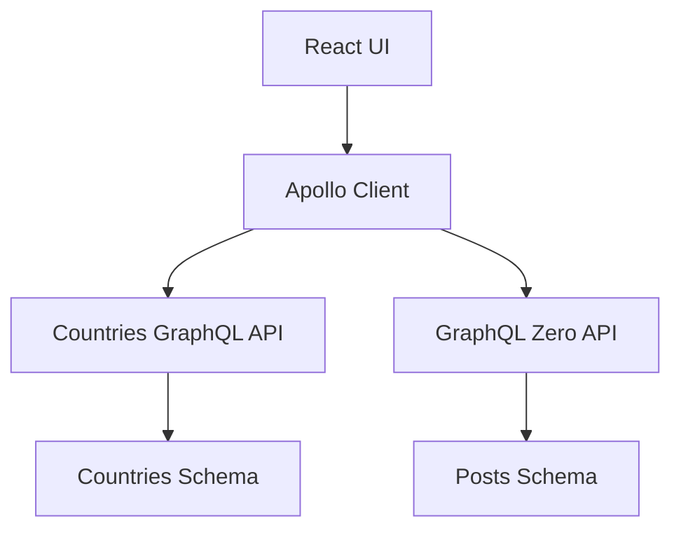
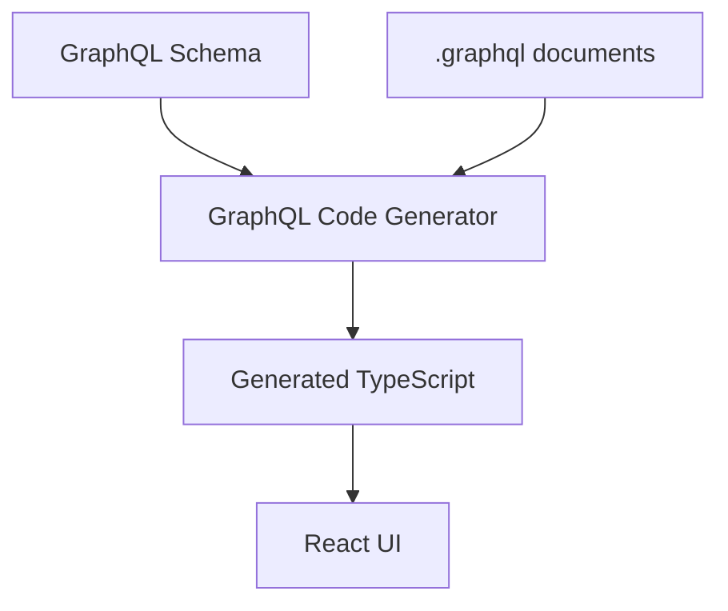

# GraphQL Country Explorer

A small React + TypeScript portfolio app that explores countries through a public GraphQL API. The goal is to show how GraphQL works on the frontend: typed operations, Apollo Client, cache behavior, and client-selected fields.

GraphQL APIs:

- Countries: [https://countries.trevorblades.com/](https://countries.trevorblades.com/)
- Posts and mutations: [https://graphqlzero.almansi.me/api](https://graphqlzero.almansi.me/api)

---

## Overview

This project demonstrates practical frontend GraphQL:

- Ask the server only for the fields the UI needs
- Pass variables into a details query
- Reuse fields with fragments
- Read nested objects such as continent, languages, and states
- Generate TypeScript types from the schema
- Keep server data in Apollo Client instead of copying it into React state
- Filter search results on the client so typing does not trigger extra GraphQL requests
- Create, update, and delete posts with GraphQL mutations
- Refresh lists with `refetchQueries` or update them locally with `cache.modify()`

The Countries API is query-only. The Posts page uses [GraphQL Zero](https://graphqlzero.almansi.me/api) to demonstrate mutations, `refetchQueries`, `cache.modify()`, and optimistic UI.

---

## Tech Stack

- React
- TypeScript
- Vite
- GraphQL
- Apollo Client
- GraphQL Code Generator
- React Router
- ESLint
- Prettier

---

## GraphQL Concepts Demonstrated

### Queries

A query reads data. `GetCountries` loads the country list, `GetCountry` loads one
country, and `GetPosts` loads a paginated posts list.

### Variables

`GetCountry($code: ID!)` receives the country code from the route. The variable is sent with the request so the same query document can fetch different countries.

### Arguments

`country(code: $code)` is a field argument. The argument selects which country the schema should return.

### Fragments

`CountrySummary` lists the shared fields used by both country views.
`PostSummary` keeps the fields returned by post queries and mutations consistent.
Fragments keep shared selections in one place.

### Nested queries

GraphQL can return related objects in one request:

- `continent { name }`
- `languages { name }`
- `states { name }`

### Schema

The schema is the API contract: types, fields, arguments, and what is nullable. The client cannot request a field that is not in the schema.

### Introspection

GraphQL Code Generator inspects both live schemas and uses them to validate the
corresponding `.graphql` documents and generate TypeScript types.

### Type generation

Country operations become typed documents in `src/generated/graphql.ts`. Post operations become typed documents in `src/generated/posts/graphql.ts`. React components import those generated types instead of writing them by hand.

### Apollo cache

Apollo stores query results in `InMemoryCache`. Country objects are normalized by `code`. Repeat visits to the same country can be served from cache.

### Loading / error / empty states

Every GraphQL operation in the UI handles:

- loading
- network or GraphQL errors
- no matching data
- successful data

### Mutations

A mutation changes data. The Posts page implements `CreatePost`, `UpdatePost`, and `DeletePost` against GraphQL Zero using `useMutation` and GraphQL variables.

### Cache updates

- **Create** uses `refetchQueries` so Apollo reloads `GetPosts`, then writes the
  mutation result into the list cache. GraphQL Zero does not persist writes, so
  the refetch alone returns the original list.
- **Delete** uses `cache.modify()` to remove the post from the cached list without another network request.
- **Update** uses an optimistic response because the new title and body are already known.

### Pagination

The Countries API returns the full country list in one query. `GetPosts` requests a small page from GraphQL Zero with `PageQueryOptions`.

---

## Architecture

```text
src/
├── apollo/          Apollo Client, split link, and cache helpers
├── graphql/         Hand-written GraphQL documents
│   ├── fragments/
│   ├── queries/
│   └── mutations/
├── generated/       Types created by GraphQL Code Generator
│   └── posts/
├── hooks/           Apollo query and mutation hooks
├── components/      UI pieces
├── pages/           Route screens
└── styles/
```





Server state (countries and posts) lives in Apollo Client. UI state (search text,
form fields, and edit mode) lives in React state. Search filters the already-cached
country list in the browser; GraphQL results are never copied into React state.

---

## Query Example

List query from `src/graphql/queries/countries.graphql`:

```graphql
query GetCountries {
  countries {
    ...CountrySummary
  }
}
```

Details query from `src/graphql/queries/country.graphql`:

```graphql
query GetCountry($code: ID!) {
  country(code: $code) {
    ...CountrySummary
    phone
    currency
    languages {
      code
      name
      native
    }
    states {
      code
      name
    }
  }
}
```

Shared fragment from `src/graphql/fragments/country.fragment.graphql`:

```graphql
fragment CountrySummary on Country {
  code
  name
  emoji
  capital
  continent {
    code
    name
  }
}
```

The list asks only for card fields. The details query asks for extra nested fields. That is GraphQL’s “ask for exactly what you need.”

---

## Posts Query Example

From `src/graphql/queries/posts.graphql`:

```graphql
query GetPosts($options: PageQueryOptions) {
  posts(options: $options) {
    data {
      ...PostSummary
    }
  }
}
```

The page and limit are passed as variables, and the response remains in Apollo
Client rather than being duplicated into component state.

---

## Mutation Example

From `src/graphql/mutations/create-post.graphql`:

```graphql
mutation CreatePost($input: CreatePostInput!) {
  createPost(input: $input) {
    ...PostSummary
  }
}
```

`useMutation(CreatePostDocument)` sends that operation with a `CreatePostInput`
variable. After create succeeds, Apollo refetches `GetPosts`, then writes the
returned post fragment into the cached list so it appears in the UI. GraphQL Zero
simulates writes but does not persist them, so the refetch alone returns the
original posts.

Delete uses a different cache strategy in `src/hooks/usePosts.ts`:
`cache.modify()` removes the post from the cached list so Apollo does not need
another `GetPosts` request. This avoids a network round trip; on GraphQL Zero, a
refetch would also restore the deleted post because writes are not persisted.

Update uses an optimistic response. Apollo immediately renders the predictable
title and body, then confirms the result or rolls it back if the request fails.

---

## Apollo Cache

Apollo Client uses `InMemoryCache` with the default `cache-first` fetch policy. No extra fetch policy is set.

Country entities are stored with a stable cache key:

```ts
new InMemoryCache({
  typePolicies: {
    Country: {
      keyFields: ['code'],
    },
  },
});
```

What that means in this app:

1. `GetCountries` writes each country into the cache as `Country:{"code":"DE"}` (for example).
2. Opening Germany reuses the cached summary fields and fetches remaining details (`phone`, `currency`, `languages`, `states`).
3. Opening Germany again can be served from cache with no extra network request.
4. Going back to the list reads `GetCountries` from cache instead of refetching.

Search does not write a second copy of the country list into `useState`. It filters the Apollo result in memory.

The same cache also stores posts. One Apollo Client talks to both APIs through a
split link. Post operations are identified by `context.clientName === "posts"`
or their operation name and routed to GraphQL Zero; country operations go to the
Countries API. Checking the operation name also ensures that named
`refetchQueries` requests use the Posts endpoint.

Post cache behavior:

1. `GetPosts` stores the first six posts in Apollo.
2. Create refetches `GetPosts` to demonstrate server synchronization.
3. Because GraphQL Zero does not persist writes, the returned mutation result is
   then added to the list with `cache.writeFragment()` and `cache.modify()`.
4. Delete removes a post with `cache.modify()` and no refetch.
5. Update uses an optimistic response and Apollo merges the returned `Post` by ID.

---

## Why GraphQL?

| Idea                   | What it means here                                                   |
| ---------------------- | -------------------------------------------------------------------- |
| Avoid over-fetching    | The list does not request `states` or `phone`                        |
| Avoid under-fetching   | Details get continent, languages, and states in one request          |
| Strongly typed schema  | Codegen fails if a query field does not exist                        |
| Client-selected fields | Each `.graphql` file declares exactly what the UI renders            |
| Nested data            | Related objects arrive together instead of as extra REST round-trips |

---

## REST vs GraphQL

|                       | REST                                                      | GraphQL                                          |
| --------------------- | --------------------------------------------------------- | ------------------------------------------------ |
| Endpoint              | Many URLs, one resource per request                       | One endpoint, many operations                    |
| Shape of the response | Server decides the JSON                                   | Client selects fields                            |
| Related data          | Often extra requests (`/countries/DE`, then `/languages`) | Nested selection in one query                    |
| Over-fetching         | Common if the payload includes unused fields              | Reduced by asking only for needed fields         |
| Under-fetching        | Common if one resource is not enough                      | Reduced by nested fields                         |
| Types                 | Optional, often documented separately                     | Built into the schema                            |
| Errors                | Usually HTTP status codes                                 | HTTP 200 with an `errors` array is common        |
| Caching               | HTTP cache by URL                                         | Normalized client cache, plus HTTP if you add it |

REST is still a good fit for file downloads, simple CRUD APIs, and HTTP caching by URL. GraphQL is a good fit when a UI needs a precise slice of a graph of data.

---

## Running locally

```bash
npm install
npm run codegen
npm run dev
```

Open the Vite URL printed in the terminal, usually `http://localhost:5173`.

---

## Build

```bash
npm run build
```

---

## Code generation

```bash
npm run codegen
```

Watch mode:

```bash
npm run codegen:watch
```

Codegen reads two schemas: the Countries API for country documents and GraphQL Zero for post documents. It writes typed documents to `src/generated/` and `src/generated/posts/`. Do not edit generated files by hand. Run codegen again after changing a GraphQL document.

---

## Learning Notes

- **Query vs mutation:** queries read; mutations write. Countries stay query-only. Posts demonstrate create, update, and delete.
- **Operation documents stay out of React components.** UI imports generated documents such as `GetCountriesDocument` and `CreatePostDocument`.
- **Variables make an operation reusable.** `GetCountry` and `CreatePost` both take variables instead of hard-coded values.
- **Fragments are copy-paste control.** Shared country fields live in `CountrySummary`. Shared post fields live in `PostSummary`.
- **The schema is the source of truth.** TypeScript types are generated from it, not invented in components.
- **Apollo cache is normalized.** The same `Country` object can satisfy both the list and details queries. Posts are keyed by `id`.
- **UI state is not server state.** Search text and form fields are React state. Country and post records stay in Apollo.
- **Loading, error, and empty are part of the GraphQL UI.** A blank screen is not a complete client.
- **`useQuery` is for data you need on render.** `useMutation` is for writes. `useLazyQuery` would fit a user-triggered fetch.
- **`refetchQueries` vs `cache.modify()`:** refetching is simple and synchronizes
  with the server. `cache.modify()` skips the extra request when the UI can apply
  the mutation result locally.
- **Optimistic UI** renders a predicted mutation result immediately, then confirms or rolls back when the server responds.
- **Public GraphQL APIs can be introspected.** That is how codegen stays in sync with the Countries API and GraphQL Zero.
